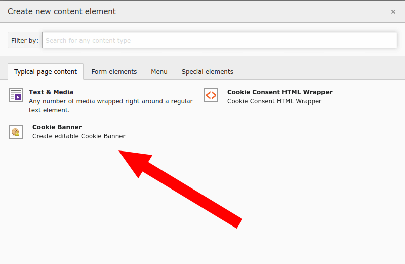
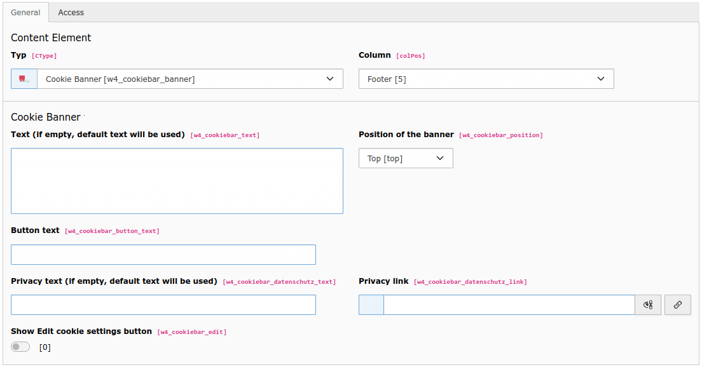
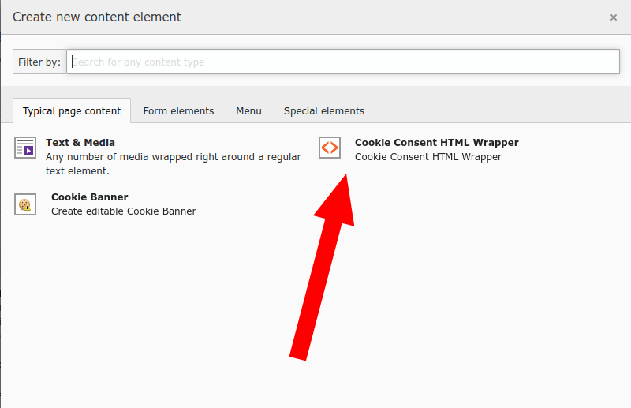
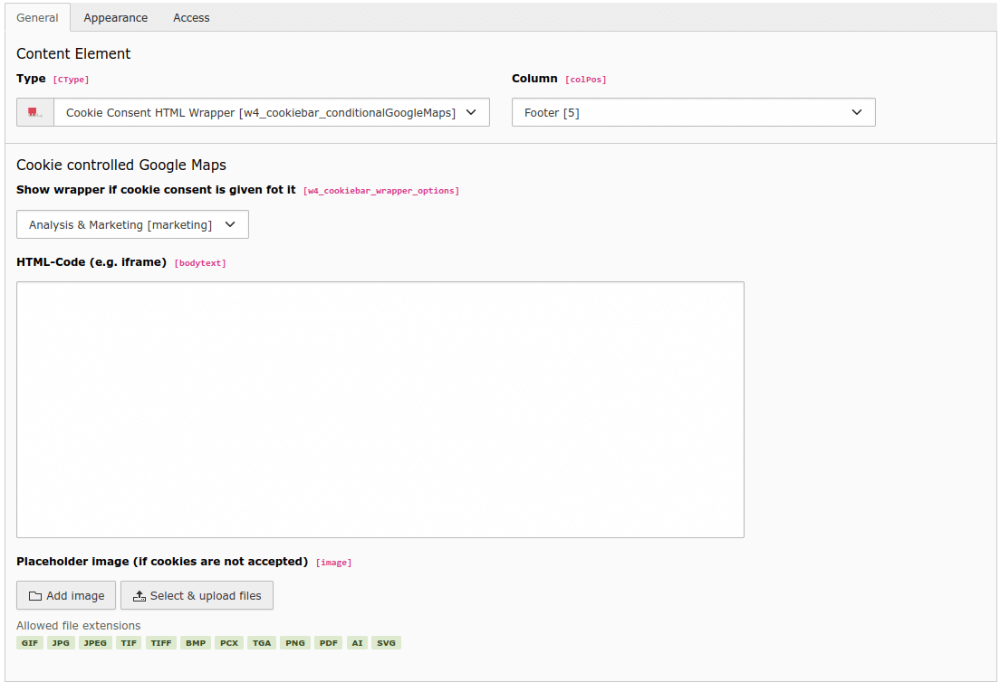

.. include:: /Includes.rst.txt

.. _configuration:

=============
Configuration
=============

In order to show the banner add a new content element of the type :guilabel:`Cookie Banner` in the the content area of a page that is going to be inherited by its subpages (usually the footer in the home page):

|
Fill up the fields with the desired values:

|
.. list-table:: Explanation
   :header-rows: 1

   * - Field
     - Description
   * - Text
     - Used to display general info about the cookie banner
   * - Position of the banner
     - To specify where the cookie banner is to be displayed in the frontend
   * - Button text
     - Button text
   * - Privacy text
     - This text will be shown as a link of the link provided in the field Privacy Link
   * - Privacy link
     - Link to the page with the privacy content
   * - Show Edit cookie settings button
     - If checked a button will be shown on the footer of the page, cliking on it will show the cookie banner wuth it has been dismissed

In order to insert a Google map (or any other code) that will be handled by the extension add a new content of the type :guilabel:`Cookie Consent Html Wrapper`:

|
Fill up the fields with the desired values:

|
.. list-table:: Explanation
   :header-rows: 1

   * - Field
     - Description
   * - Show wrapper if cookie consent is given fot it
     - The group of cookies that have to be accepted to render the content
   * - HTML-Code (e.g. iframe)
     - The code to be rendered
   * - Placeholder image (if cookies are not accepted)
     - The image to be used as a placeholder
