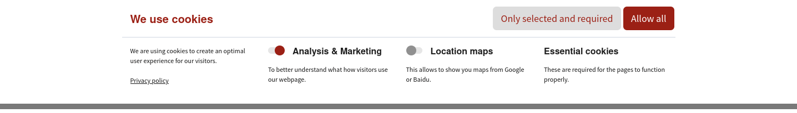
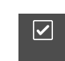

.. include:: /Includes.rst.txt

.. _introduction:

============
Introduction
============

W4 Cookiebar provides a GDPR cookie banner, allowing visitors to handle the cookies of the site.

The banner can be placed in the top or the bottom of the page:

|
When the banner is dismissed, a button to open it can be placed at one of the bottom corners of the page:

